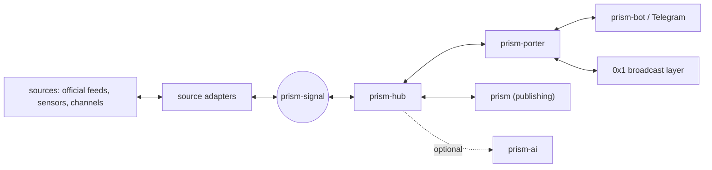

# prism-signal

Prism Signal is the signal-intelligence boundary of the Prism ecosystem: it normalizes incoming evidence, places it on a deterministic geographic grid, fuses it into explicit assessments, and hands those assessments to the hub for delivery.

**evidence in → cells → assessment out → feedback back in**

Prism Signal is the octopus's brain, not its hands. Sources and transports are tentacles behind ports; every tentacle can carry traffic in both directions.

## What Prism Signal owns

- `SignalObservation` — one normalized piece of evidence with source, time, geometry, and provenance;
- geographic cell derivation and polygon covering on the H3 grid profile defined by `0x1`;
- deterministic fusion of an observation window into a `SignalAssessment`;
- assessment lifecycle: issue, supersede, expire, retract;
- source adapters behind one stable port;
- the versioned `prism-signal.v1` JSON/NDJSON protocol.

Prism Signal does not own accounts, identities, subscriptions, scheduling, persistence, delivery transports, broadcast authentication, client UI, infrastructure, or ai generation. Those stay with `prism-hub`, `prism-porter`, `prism-bot`, `0x1`, and `prism-ai`.

## Shape



The runtime is stateless. The hub supplies the observation window with every request and persists whatever it decides to keep; Prism Signal remembers nothing between calls.

## Documentation

| Document | Purpose |
| --- | --- |
| [`architecture`](docs/architecture.md) | Ownership, dependency direction, fusion, assessment lifecycle |
| [`geo cells`](docs/geo-cells.md) | H3 profile, polygon covering, cell fan-out without a subscriber registry |
| [`two-way flows`](docs/flows.md) | Inbound evidence, outbound assessments, feedback, and the `0x1` bridge |
| [`Telegram source`](docs/sources/telegram.md) | Public channel preview adapter and the collector |
| [`normalization`](docs/normalization.md) | Post text to hazard readings, place roles, the gazetteer, measured coverage |
| [`air-threat relay`](docs/air-alerts.md) | The first product: relay one channel's hazard reports by location; owners, gaps, open decisions |
| [`protocol`](docs/protocol.md) | `prism-signal.v1` draft |
| [`ecosystem`](docs/ecosystem.md) | Proposed rows for `prism/docs/ecosystem.md` and the dependency rules |
| [`implementation status`](docs/status.md) | What exists now (nothing) and what is open |
| [`roadmap`](docs/roadmap.md) | Evidence-driven implementation order |

## Workspace

| Package | Owns |
| --- | --- |
| `prism-signal-core` | Source-neutral evidence values |
| `prism-signal-source` | Evidence source port |
| `prism-signal-source-telegram` | Telegram public channel preview adapter |
| `prism-signal-normalize` | Hazard readings from post text: kind, phase, and located places with roles |
| `prism-signal-collect` | NDJSON collector CLI |

```bash
cargo run -p prism-signal-collect -- telegram vanek_nikolaev backfill > vanek.ndjson
cargo run -p prism-signal-normalize -- --actionable < vanek.ndjson
```

## Status

Evidence collection from Telegram public channels, and normalization of its text into hazard readings with located places. Fusion, cells, and the protocol are still design. No license file exists yet. The intended license is Apache-2.0 to match `prism`; this is a proposal until the repository policy is added.

<!-- © 2026 aiaiaiai · aiaiaiai.org -->
