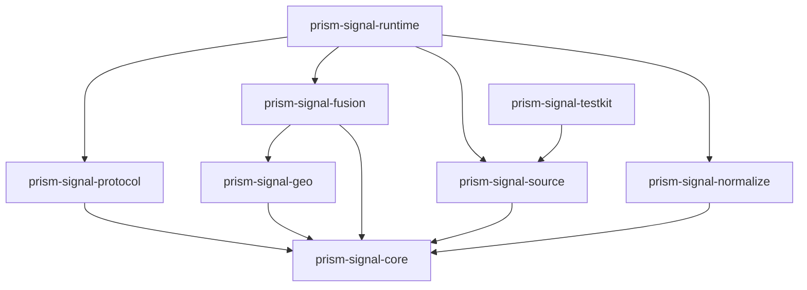
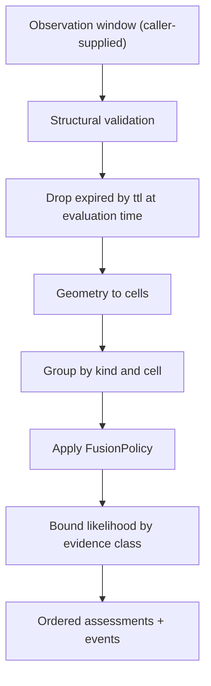

# Architecture

## Purpose

Prism Signal turns heterogeneous evidence into explicit, versioned, time-bounded assessments about places. It owns the meaning of an observation and the deterministic rules that combine observations. It does not decide who is told, through which transport, or under whose authority.

Five rules shape the design:

1. the runtime is stateless: the caller supplies the observation window and the evaluation time;
2. fusion is a pure function of `(observations, policy version, evaluation time)`;
3. a source is an adapter behind a port, never a branch in the core;
4. an assessment is a proposal, not an authority: emitting an alert is a hub decision;
5. precision is never fabricated: a likelihood is reported in the form its evidence supports.

All implementations follow the normative rules in [`prism/docs/engineering-principles.md`](https://github.com/aiaiaiai-org/prism/blob/master/docs/engineering-principles.md).

## Dependency direction

`prism-signal-core` has no network, storage, process, client, hub, mail, or ai dependency. Runtime depends on contracts; contracts never depend on runtime.

## Canonical concepts

- `SignalSource` — a declared origin with a reliability class and a stated validity model. It is identified by an opaque `source_id`.
- `SignalObservation` — one normalized piece of evidence: `source_id`, `kind`, `observed_at`, `geometry`, `ttl`, source-declared `confidence` (optional), and provenance. Immutable.
- `Geometry` — `point`, `polygon`, or an explicit `cells` list. Coordinates are WGS84 longitude/latitude and are treated as evidence, never as stored identity.
- `CellSet` — a set of H3 cell identifiers at one resolution, derived from geometry. See [`geo-cells.md`](geo-cells.md).
- `FusionPolicy` — a versioned, declarative rule set: which kinds combine, how sources are weighted, decay, corroboration thresholds.
- `SignalAssessment` — hazard `kind`, `cells`, `likelihood`, `severity`, `valid_from`, `valid_until`, evidence references, `policy_version`, and a stable `assessment_id`.
- `AssessmentEvent` — `issued`, `superseded`, `expired`, or `retracted`, linked by `assessment_id` and sequence number, carrying no wall-clock time of its own.

## Fusion

Evaluation time is an input, never read from a clock. The same window, policy, and time always produce byte-identical assessments, so results are replayable and testable.

### Likelihood is a band unless evidence earns a number

| Evidence | Reported form |
| --- | --- |
| Single uncorroborated source | `band` only (`low`, `moderate`, `high`) |
| Multiple independent corroborating sources | `band` with `corroboration_count` |
| A source that publishes a calibrated probability | that probability, tagged with the originating `source_id` |

Prism Signal never converts a band into a percentage. A fused number appears only when the policy names a calibration that the evidence class supports. `model`-derived scores may be attached as provenance but never replace deterministic fusion.

### Authority

An assessment is a proposal. Turning it into an alert requires the hub to apply an issuer policy: which assessments may be sent, to which audience, with what human or rule approval. This mirrors the `0x1` rule that a model decision is not authority.

Prism Signal is not a substitute for official warning systems. Where an official channel exists it is a source, and its messages keep their provenance end to end.

## Lifecycle

An assessment is issued once and thereafter only superseded, expired, or retracted. Consumers receive a new event, never a silent mutation. Expiry is derived from `valid_until` and evaluation time. A retraction carries a reason class and references the assessment it withdraws, so a wrong alert is corrected on the same path that produced it.

## Failure

Every operation returns typed failures: `invalid_geometry`, `cover_too_large`, `unknown_policy`, `unsupported_kind`, `source_unavailable`. An unavailable source is a typed failure, never a substituted value. Fusion over an empty or fully expired window returns an empty result, not a default assessment.

## Privacy

Prism Signal never receives client identities, device identifiers, or subscriptions. Client-originated evidence enters only as cell-level, k-thresholded aggregates defined by `0x1`, so the signal layer cannot build a social or location graph. Exact coordinates in an observation are evidence about an event, not about a person.

## Invariants

1. Fusion is a pure function of its inputs.
2. The runtime holds no state between calls.
3. An assessment is never authority to send an alert.
4. A likelihood is never more precise than its evidence.
5. Assessments change only by explicit events.
6. A source adapter never changes core behavior.
7. Cells are derived from geometry; cells never replace source evidence.
