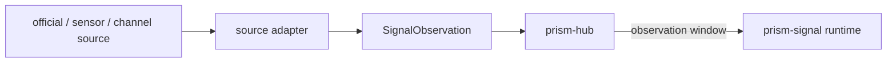
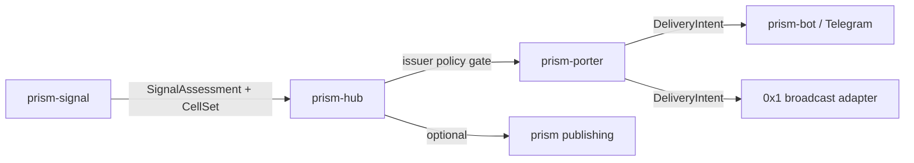

# Two-way flows

## Purpose

Every tentacle in the ecosystem carries traffic in both directions. This document names each direction, who owns it, and what may cross.

## Inbound: evidence to Prism Signal

- Adapters read a source through a focused port and return normalized observations.
- The hub owns scheduling, credentials, and storage of the window. Prism Signal never polls on its own.
- `prism-mail` already produces signal-shaped artifacts; a `prism-mail` digest may enter as one source kind through the same port rather than a special path.

## Outbound: assessments to people

1. Prism Signal returns an assessment and its cells.
2. The hub applies issuer policy and decides audience.
3. `prism-porter` renders a `signal.alert` artifact into a context-bound `DeliveryIntent` with a stable idempotency key.
4. A transport adapter delivers it. Prism Signal never calls a transport.

Public publication through `prism` is a separate, explicit hub decision using the existing two-phase preflight and dispatch.

## Feedback: delivery and clients back to Prism Signal

| Signal | Origin | Crosses as | Used for |
| --- | --- | --- | --- |
| Delivery receipts | transport adapters via hub | aggregate counts per cell and assessment | coverage checks |
| Client reports | `0x1` clients | cell-level, k-thresholded aggregates | corroboration evidence |
| Corrections | issuer or operator via hub | `retracted` or `superseded` events | lifecycle |

Individual client reports, identities, and coordinates never cross into Prism Signal. This follows the `0x1` disclosure rule that public aggregates are protected by `k >= 20` and that no operator-visible social graph may be created.

## The 0x1 bridge

`0x1` is a protocol, not a peer service, so the bridge has two halves:

| Half | Owner | Content |
| --- | --- | --- |
| Alert class and envelope | `nilx-one/0x1` specification | a broadcast `class` for hazard alerts, its `broadcast_body`, TTL, and gating; must be added before any adapter is written |
| Delivery adapter | a `prism-bot`-style adapter | maps a `DeliveryIntent` to that envelope, authenticates as `0x1` requires, and reports aggregate receipts |

The broadcast layer requires App Attest assertions, one-time challenges, epoch-key rotation, and certificate pinning. Prism Signal holds none of those credentials; the adapter does. `nilx-one/core` currently has empty command and event registries "until an owning interaction contract exists", so the class must be specified in `0x1` first and only then implemented in `core`.

Open in `0x1` and unresolved here: whether broadcast reaches every attested client in a cell or only those within `N` edges of the sender.

## Invariants

1. Clients depend on the hub, not on Prism Signal.
2. Prism Signal never calls a transport, client, or `0x1` directly.
3. Only aggregates cross the feedback path.
4. Corrections travel on the same path as the original assessment.
